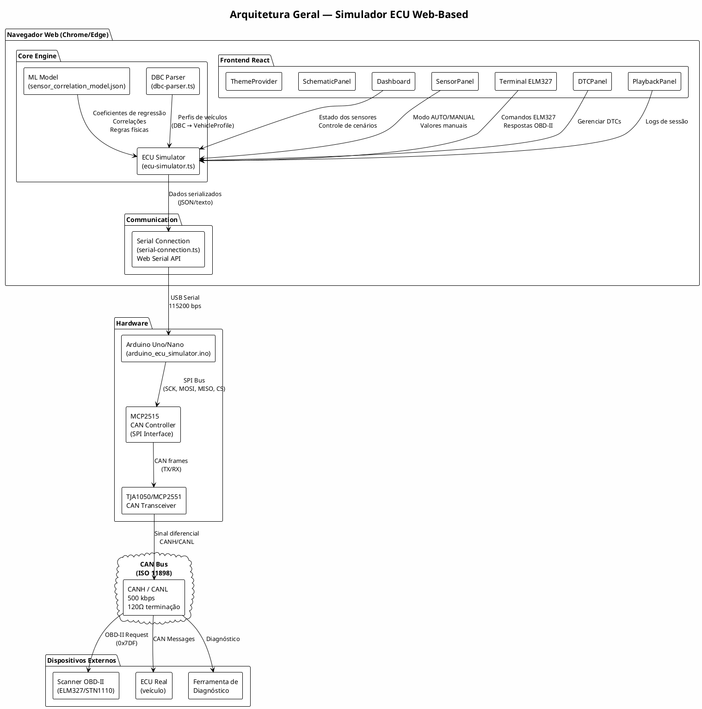
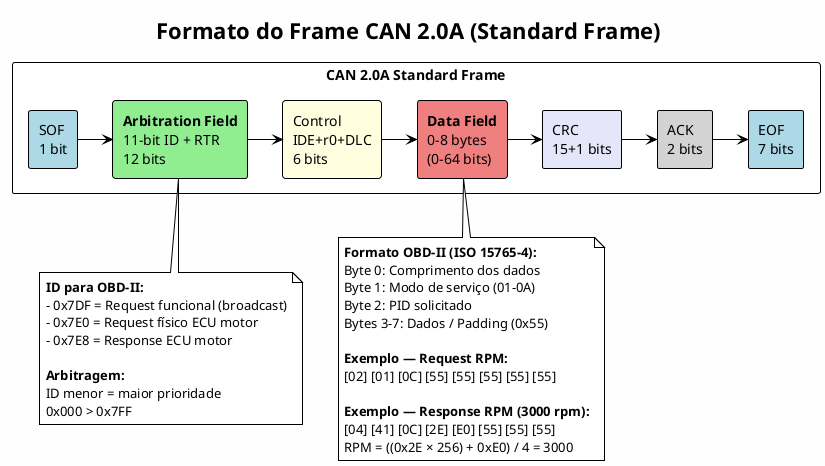
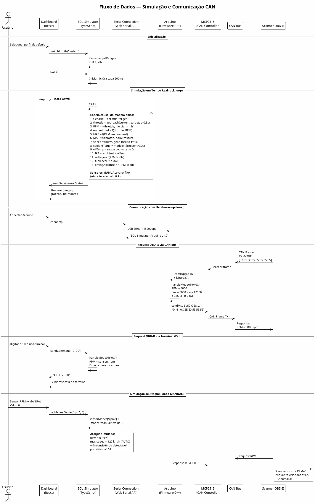
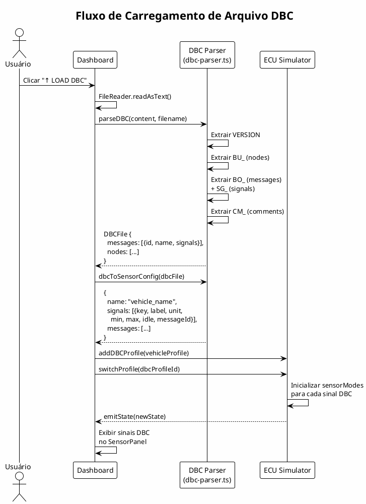
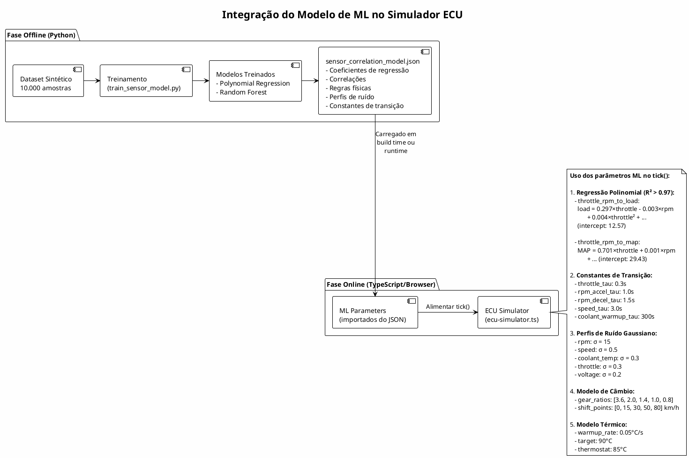
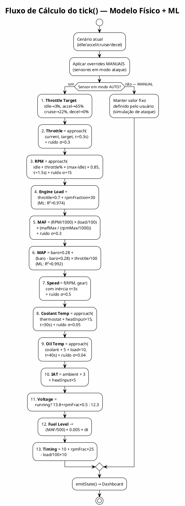
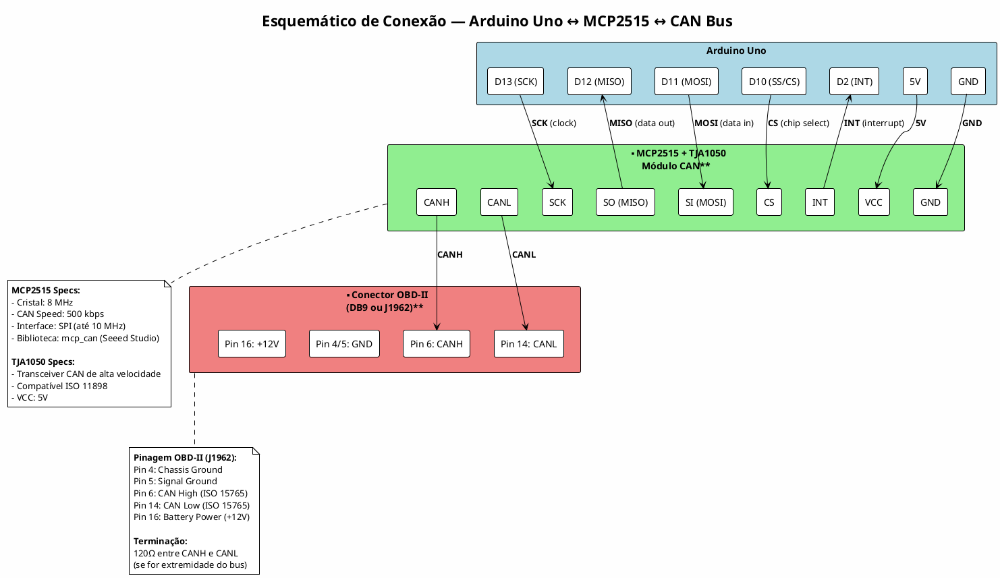
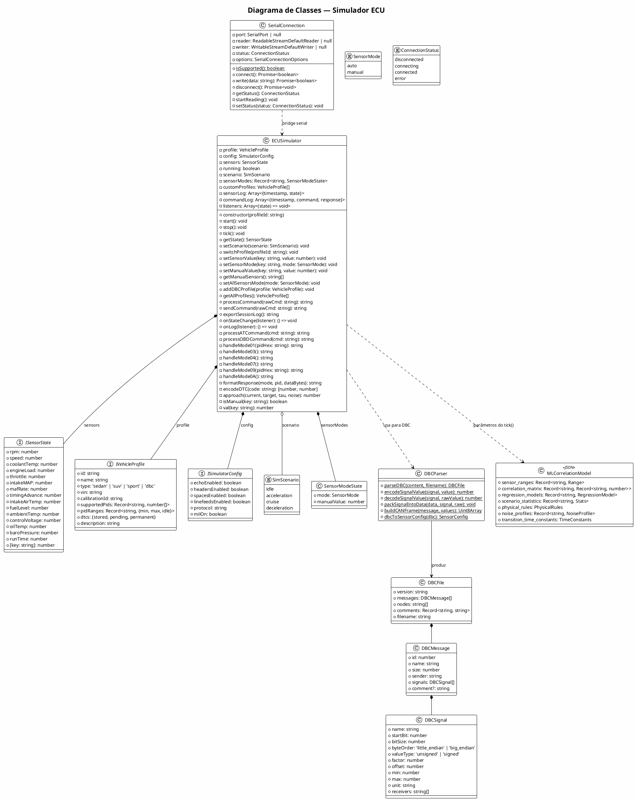
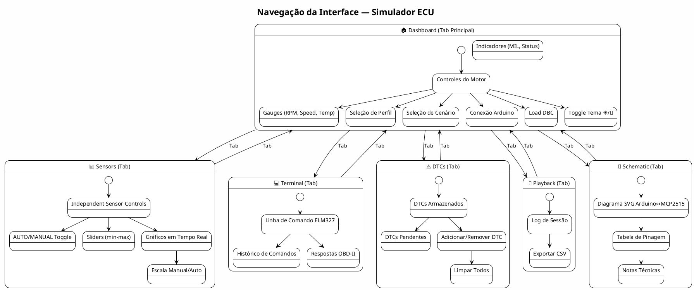

# Arquitetura do Sistema — Simulador ECU Web-Based

**Autor:** Marcelo Duchene  
**Data:** 2026  
**Versão:** 2.0

---

## 1. Visão Geral do Sistema

O Simulador ECU Web-Based é uma plataforma para simulação de unidades de controle eletrônico (ECU) automotivas, projetada para pesquisa em segurança cibernética automotiva. O sistema permite:

- Simular dados realistas de sensores OBD-II com modelo baseado em física
- Conectar-se a hardware real (Arduino + MCP2515) via Web Serial API
- Injetar valores anômalos para simulação de ataques CAN bus (spoofing, replay, fuzzing)
- Carregar perfis de veículos via arquivos DBC (Vector CANdb++)
- Integrar modelo de ML para coerência entre sensores

### 1.1 Componentes Principais

| Componente | Tecnologia | Responsabilidade |
|---|---|---|
| Frontend Web | React + TypeScript + Tailwind CSS + shadcn/ui | Interface do usuário, visualização, controle |
| ECU Simulator Engine | TypeScript (browser) | Motor de simulação com modelo físico |
| ML Correlation Model | JSON (pré-treinado em Python) | Parâmetros de correlação entre sensores |
| DBC Parser | TypeScript (browser) | Parser de arquivos DBC para perfis de veículos |
| Web Serial Bridge | Web Serial API (browser) | Comunicação serial com Arduino |
| Arduino Firmware | C++ (Arduino IDE) | Controlador de hardware CAN |
| MCP2515 + TJA1050 | Hardware SPI | Transceiver CAN bus |
| CAN Bus | Barramento físico | Rede de comunicação automotiva |

---

## 2. Arquitetura Geral do Sistema



---

## 3. Diagrama do Barramento CAN

### 3.1 Topologia do Barramento CAN

```plantuml
@startuml can_bus_topology
!theme plain
skinparam backgroundColor #FEFEFE

title Topologia do Barramento CAN — Simulador ECU

rectangle "Nó 1: Simulador ECU\n(Arduino + MCP2515)" as node1 {
  rectangle "Arduino Uno" as ard1
  rectangle "MCP2515" as mcp1
  rectangle "TJA1050" as xcvr1
  ard1 -right-> mcp1 : SPI
  mcp1 -right-> xcvr1 : TX/RX
}

rectangle "Nó 2: Scanner OBD-II\n(ELM327 / Ferramenta)" as node2 {
  rectangle "ELM327" as elm
  rectangle "Transceiver" as xcvr2
  elm -right-> xcvr2 : CAN
}

rectangle "Nó 3: ECU Real\n(opcional)" as node3 {
  rectangle "ECU Motor" as ecum
  rectangle "Transceiver" as xcvr3
  ecum -right-> xcvr3 : CAN
}

rectangle "120Ω" as term1
rectangle "120Ω" as term2

xcvr1 -down- term1
term1 -right-[#blue,bold] xcvr2 : **CANH**
xcvr2 -right- term2
term2 -right- xcvr3

note bottom of term1
  Resistor de terminação
  no início do barramento
end note

note bottom of term2
  Resistor de terminação
  no final do barramento
end note

note as N1
  **Barramento CAN 2.0A**
  - Velocidade: 500 kbps (ISO 15765-4)
  - 2 fios: CANH (dominante ~3.5V) / CANL (dominante ~1.5V)
  - Comprimento máx: ~40m a 500kbps
  - Terminação: 120Ω em cada extremidade
  - Arbitragem: CSMA/CD + prioridade por ID
end note
@enduml
```

### 3.2 Formato do Frame CAN 2.0A (Standard)



### 3.3 Tabela de CAN IDs OBD-II

| CAN ID | Direção | Descrição |
|--------|---------|-----------|
| 0x7DF | Request → | Endereço funcional (broadcast para todas as ECUs) |
| 0x7E0 | Request → | Endereço físico da ECU do motor |
| 0x7E1 | Request → | Endereço físico da ECU da transmissão |
| 0x7E8 | ← Response | Resposta da ECU do motor |
| 0x7E9 | ← Response | Resposta da ECU da transmissão |

### 3.4 Modos de Serviço OBD-II Suportados

| Modo | Request | Response | Descrição |
|------|---------|----------|-----------|
| 01 | 01 XX | 41 XX DD | Dados em tempo real (PIDs) |
| 02 | 02 XX | 42 XX DD | Freeze frame data |
| 03 | 03 | 43 NN DD | DTCs armazenados |
| 04 | 04 | 44 | Limpar DTCs e MIL |
| 07 | 07 | 47 NN DD | DTCs pendentes |
| 09 | 09 XX | 49 XX DD | Informações do veículo (VIN, Cal ID) |
| 0A | 0A | 4A NN DD | DTCs permanentes |

---

## 4. Fluxo de Dados entre Componentes

### 4.1 Fluxo Principal: Dashboard ↔ ECU Simulator ↔ Arduino ↔ CAN Bus



### 4.2 Fluxo de Carregamento DBC



---

## 5. Estrutura das Mensagens CAN/OBD-II

### 5.1 Encoding de PIDs OBD-II

| PID | Sensor | Fórmula de Encoding | Bytes | Exemplo |
|-----|--------|---------------------|-------|---------|
| 0x04 | Engine Load (%) | A = Load × 255 / 100 | 1 | 50% → 0x80 |
| 0x05 | Coolant Temp (°C) | A = Temp + 40 | 1 | 90°C → 0x82 |
| 0x0B | MAP (kPa) | A = MAP | 1 | 35 kPa → 0x23 |
| 0x0C | RPM | raw = RPM × 4; A = raw>>8; B = raw&0xFF | 2 | 3000 → 0x2E 0xE0 |
| 0x0D | Speed (km/h) | A = Speed | 1 | 100 → 0x64 |
| 0x0E | Timing Advance (°) | A = Advance × 2 + 128 | 1 | 10° → 0x94 |
| 0x0F | IAT (°C) | A = Temp + 40 | 1 | 25°C → 0x41 |
| 0x10 | MAF (g/s) | raw = MAF × 100; A = raw>>8; B = raw&0xFF | 2 | 15.5 → 0x06 0x0E |
| 0x11 | Throttle (%) | A = Throttle × 255 / 100 | 1 | 25% → 0x40 |
| 0x1F | Run Time (s) | A = time>>8; B = time&0xFF | 2 | 300s → 0x01 0x2C |
| 0x2F | Fuel Level (%) | A = Fuel × 255 / 100 | 1 | 65% → 0xA6 |
| 0x33 | Baro Pressure (kPa) | A = Pressure | 1 | 101 → 0x65 |
| 0x42 | Voltage (V) | raw = V × 1000; A = raw>>8; B = raw&0xFF | 2 | 13.8V → 0x35 0xE8 |
| 0x46 | Ambient Temp (°C) | A = Temp + 40 | 1 | 22°C → 0x3E |
| 0x5C | Oil Temp (°C) | A = Temp + 40 | 1 | 95°C → 0x87 |

### 5.2 Formato de Frame CAN para Request/Response OBD-II

**Request (Scanner → ECU):**
```
CAN ID: 0x7DF (broadcast) ou 0x7E0 (físico)
DLC: 8
Data: [NumBytes] [Mode] [PID] [0x55] [0x55] [0x55] [0x55] [0x55]

Exemplo — Request RPM:
0x7DF [02] [01] [0C] [55] [55] [55] [55] [55]
```

**Response (ECU → Scanner):**
```
CAN ID: 0x7E8
DLC: 8
Data: [NumBytes] [Mode+0x40] [PID] [DataA] [DataB] ... [0x55 padding]

Exemplo — Response RPM = 3000:
0x7E8 [04] [41] [0C] [2E] [E0] [55] [55] [55]
```

### 5.3 Formato de Sinais DBC (Vector CANdb++)

```
BO_ <CAN_ID> <MessageName>: <DLC> <Sender>
 SG_ <SignalName> : <StartBit>|<BitSize>@<ByteOrder><ValueType> (<Factor>,<Offset>) [<Min>|<Max>] "<Unit>" <Receivers>
```

**Parâmetros de um sinal DBC:**

| Campo | Descrição | Exemplo |
|-------|-----------|---------|
| StartBit | Posição do bit inicial no frame | 24 |
| BitSize | Número de bits do sinal | 16 |
| ByteOrder | 1 = Little Endian (Intel), 0 = Big Endian (Motorola) | 1 |
| ValueType | + = Unsigned, - = Signed | + |
| Factor | Fator de escala: physical = raw × factor + offset | 0.25 |
| Offset | Offset de conversão | 0 |
| Min/Max | Range físico do sinal | [0\|16383.75] |
| Unit | Unidade de medida | "rpm" |

**Conversão:**
- Physical → Raw: `raw = (physical - offset) / factor`
- Raw → Physical: `physical = raw × factor + offset`

---

## 6. Integração do Modelo de ML

### 6.1 Arquitetura de Integração



### 6.2 Parâmetros do Modelo ML Utilizados

| Modelo | Inputs | Output | R² | Uso no Simulador |
|--------|--------|--------|-----|------------------|
| throttle_rpm_to_load | throttle, RPM | Engine Load (%) | 0.974 | Calcular carga do motor a cada tick |
| throttle_rpm_to_map | throttle, RPM | MAP (kPa) | 0.992 | Calcular pressão do coletor |
| rpm_to_speed | RPM + gear | Speed (km/h) | 0.759 | Calcular velocidade com modelo de marchas |
| rpm_throttle_to_maf | RPM, throttle | MAF (g/s) | 0.001* | Substituído por modelo físico (RPM × VE × density) |

*\* O modelo MAF teve R² muito baixo, indicando que MAF depende de mais variáveis. Usamos modelo físico baseado em cilindrada e eficiência volumétrica.*

### 6.3 Correlações Principais (da Matriz de Correlação)

```
throttle ←→ MAP:          r = +0.996 (quase linear)
throttle ←→ engine_load:  r = +0.977 (forte)
engine_load ←→ MAP:       r = +0.975 (forte)
RPM ←→ speed:             r = +0.935 (forte, via marchas)
IAT ←→ throttle:          r = +0.796 (moderada, aquecimento)
coolant_temp ←→ fuel_level: r = -0.669 (inversa, tempo de uso)
```

### 6.4 Fluxo de Cálculo no tick() com ML



---

## 7. Esquemático de Hardware

### 7.1 Conexão Arduino ↔ MCP2515



### 7.2 Tabela de Pinagem Detalhada

| Arduino Uno | Pino | MCP2515 | Função | Protocolo |
|-------------|------|---------|--------|-----------|
| D13 | 13 | SCK | Serial Clock | SPI |
| D12 | 12 | SO (MISO) | Master In Slave Out | SPI |
| D11 | 11 | SI (MOSI) | Master Out Slave In | SPI |
| D10 | 10 | CS | Chip Select (ativo LOW) | SPI |
| D2 | 2 | INT | Interrupção (ativo LOW) | GPIO |
| 5V | — | VCC | Alimentação | Power |
| GND | — | GND | Terra | Power |

| MCP2515/TJA1050 | Conector OBD-II | Função |
|------------------|-----------------|--------|
| CANH | Pin 6 | CAN High |
| CANL | Pin 14 | CAN Low |
| GND | Pin 4/5 | Ground |

---

## 8. Diagrama de Classes



---

## 9. Navegação da Interface (UI Navigation)



---

## 10. Cenários de Uso para Segurança Cibernética

### 10.1 Ataques Simuláveis

| Ataque | Configuração no Simulador | Detecção Esperada |
|--------|---------------------------|-------------------|
| **Spoofing de RPM** | RPM → MANUAL = 0, Speed → AUTO (alto) | RPM=0 com velocidade alta é impossível |
| **Replay Attack** | Todos sensores → MANUAL com valores fixos | Valores estáticos sem variação natural (sem ruído) |
| **Fuzzing** | Valores aleatórios extremos em sensores MANUAL | Valores fora dos ranges físicos possíveis |
| **DoS (Denial of Service)** | Enviar muitos comandos OBD-II rapidamente | Sobrecarga de respostas no barramento |
| **Injeção de DTC** | Adicionar DTCs falsos via DTCPanel | DTCs inconsistentes com estado do motor |
| **Temperatura Anômala** | Coolant → MANUAL = 150°C | Temperatura impossível em operação normal |

### 10.2 Modo Normal vs. Modo Ataque

```
Modo Normal (AUTO):
  RPM=750 → Speed=0 → Load=20% → MAF=4 g/s → MAP=35 kPa
  (Todos coerentes, com ruído gaussiano natural)

Modo Ataque (MANUAL em RPM):
  RPM=0 (MANUAL) → Speed=100 (AUTO) → Load=35% (AUTO) → MAF=15 (AUTO)
  ⚠️ ANOMALIA: RPM=0 impossível com velocidade e carga altas
  → Sistema IDS deve detectar esta inconsistência
```

---

## 11. Estrutura de Arquivos do Projeto

```
/workspace/
├── app/
│   └── frontend/
│       ├── public/
│       │   └── arduino_ecu_simulator.ino    # Firmware Arduino
│       ├── src/
│       │   ├── components/
│       │   │   ├── Dashboard.tsx             # Painel principal
│       │   │   ├── SensorPanel.tsx           # Controles de sensores
│       │   │   ├── Terminal.tsx              # Terminal ELM327
│       │   │   ├── DTCPanel.tsx              # Gerenciamento de DTCs
│       │   │   ├── PlaybackPanel.tsx         # Reprodução de logs
│       │   │   └── SchematicPanel.tsx        # Esquemático Arduino
│       │   ├── lib/
│       │   │   ├── ecu-simulator.ts          # Motor de simulação ECU
│       │   │   ├── serial-connection.ts      # Web Serial API
│       │   │   ├── dbc-parser.ts             # Parser de arquivos DBC
│       │   │   └── theme-context.tsx         # Contexto de tema
│       │   ├── pages/
│       │   │   └── Index.tsx                 # Página principal
│       │   └── hooks/
│       ├── index.html
│       ├── package.json
│       └── tailwind.config.ts
├── data/
│   ├── can_bus_analysis_report.md            # Relatório de análise
│   ├── can_bus_research_findings.md          # Pesquisa de datasets
│   ├── sensor_correlation_model.json         # Modelo ML (JSON)
│   ├── datasets/
│   │   └── synthetic_obd2_driving_data.csv   # Dataset sintético
│   └── ml_model/
│       └── train_sensor_model.py             # Script de treinamento
├── docs/
│   └── system_architecture.md                # Este documento
└── capitulo_simulador_ecu.tex                # Documentação LaTeX
```

---

## 12. Aspectos Não Claros / Suposições

1. **ISO-TP (ISO 15765-2):** A implementação atual não suporta multi-frame ISO-TP completo. O VIN (17 caracteres) requer multi-frame mas está simplificado para single-frame. Para produção, implementar segmentação First Frame / Consecutive Frame / Flow Control.

2. **Modelo MAF:** O modelo de regressão para MAF teve R² = 0.001 (muito baixo). Isso indica que MAF depende de variáveis não capturadas (cilindrada, eficiência volumétrica, temperatura, altitude). O simulador usa modelo físico simplificado: `MAF ≈ (RPM/1000) × (load/100) × fator_motor`.

3. **Velocidade do CAN Bus:** Assumimos 500 kbps (padrão OBD-II / ISO 15765-4). Alguns veículos usam 250 kbps. O cristal do MCP2515 é assumido como 8 MHz.

4. **Modelo de Câmbio:** O simulador usa modelo simplificado de 5 marchas com shift points fixos. Um modelo real teria curvas de torque do motor e lógica de transmissão automática/manual.

5. **Integração ML em Runtime:** Os parâmetros do modelo ML estão em JSON estático. Para integração mais sofisticada, poderia-se usar TensorFlow.js ou ONNX.js para inferência de Random Forest diretamente no browser.

6. **Segurança da Web Serial API:** A Web Serial API requer HTTPS e interação do usuário (click) para solicitar acesso à porta serial. Não funciona em HTTP puro ou sem gesto do usuário.

7. **Terminação CAN Bus:** Se o módulo MCP2515 for a única extremidade do barramento, precisa de resistor de terminação de 120Ω entre CANH e CANL. Muitos módulos já incluem este resistor soldado na placa.

---

© 2026 Marcelo Duchene — Todos os direitos reservados